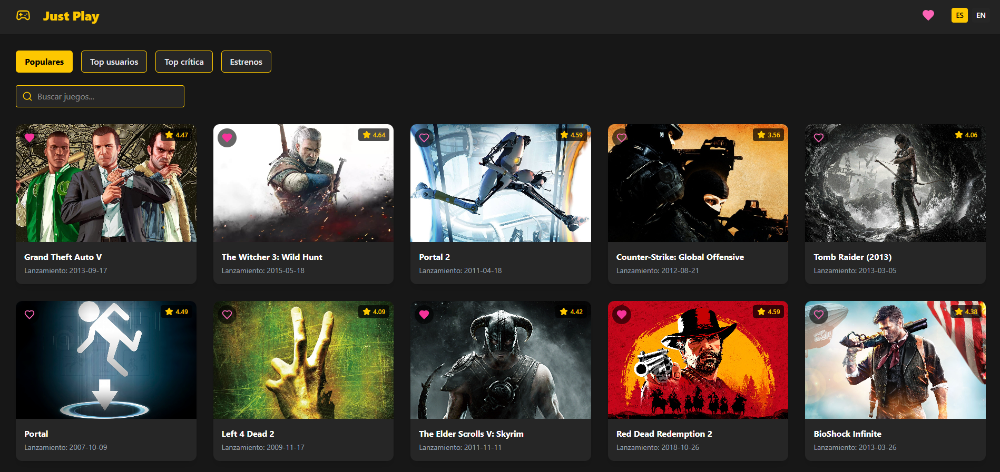
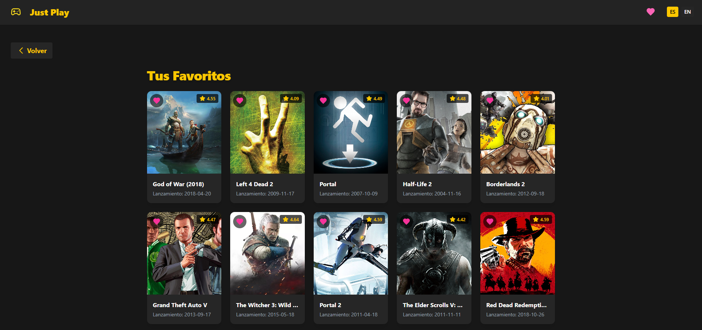
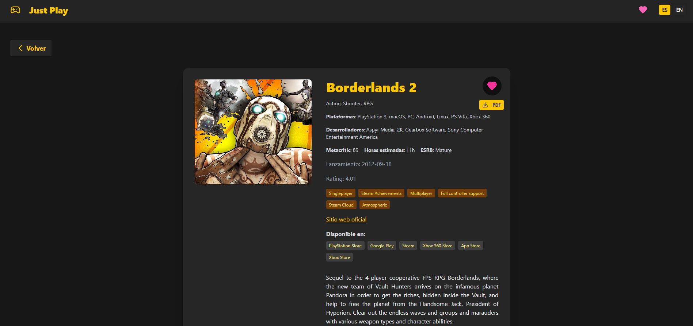

# 🎮 Just Play

## 👥 Integrantes del Grupo
- Hernandez Martín FAI-4433
- Metzger German FAI-3521
- Bucarey Mateo FAI-4319

## 📝 Descripción
Just Play es una aplicación web desarrollada con React que permite explorar, buscar y gestionar juegos. Los usuarios pueden:

- Buscar y filtrar juegos por popularidad, rating, crítica y estrenos
- Marcar juegos como favoritos y ver su lista personalizada
- Ver detalles completos de cada juego
- Descargar la información de un juego en PDF
- Cambiar el idioma de la app (Español/Inglés)
- Persistencia de favoritos y preferencias en localStorage

## 🚀 Tecnologías Utilizadas
- **React** (v19)
- **TypeScript**
- **Tailwind CSS** (v4)
- **React Router DOM** (v7)
- **Lucide React** (iconos)
- **react-i18next** (internacionalización)
- **jsPDF** (exportar a PDF)
- **Axios** (peticiones HTTP)
- **LocalStorage** (persistencia de favoritos y preferencias)
- **Vite** (build tool)

## ⚙️ Instalación

1. Clonar el repositorio:
```bash
git clone https://github.com/MartinCba/TP-React-II.git
cd TP-React-PWA-II
```

2. Instalar dependencias:
```bash
npm install
```

3. Iniciar la aplicación en modo desarrollo:
```bash
npm run dev
```

La aplicación estará disponible en `http://localhost:5173`

## 🎯 Características Principales

### Sistema de Filtros y Búsqueda
- Filtros por: Populares, Top usuarios, Top crítica, Estrenos
- Búsqueda por nombre de juego

### Gestión de Favoritos
- Marcar/desmarcar juegos como favoritos
- Visualizar y gestionar la lista de favoritos

### Detalles de Juegos
- Información completa: plataformas, desarrolladores, géneros, rating, metacritic, descripción, etc.
- Exportar detalles a PDF

### Internacionalización
- Soporte multi-idioma (Español/Inglés)
- Preferencia de idioma guardada en localStorage

### UI/UX
- Interfaz moderna, responsiva y con tema oscuro
- Animaciones y transiciones suaves
- Accesibilidad básica

## 💾 Persistencia de Datos
La aplicación utiliza localStorage para mantener los favoritos y la preferencia de idioma incluso después de cerrar el navegador.

## 📦 Librerías y Dependencias

- **react**: ^19.0.0
- **react-dom**: ^19.0.0
- **react-router-dom**: ^7.5.3
- **typescript**: ~5.7.2
- **tailwindcss**: ^4.1.4
- **@tailwindcss/vite**: ^4.1.4
- **lucide-react**: ^0.507.0
- **react-i18next**: ^15.5.1
- **i18next**: ^25.1.1
- **jspdf**: ^3.0.1
- **axios**: ^1.9.0
- **tailwind-merge**: ^3.2.0

## 📚 Estructura del Proyecto
```
src/
├── components/     # Componentes reutilizables (Card, Header, Footer, etc.)
├── pages/          # Páginas principales (Home, Details, Favorites)
├── services/       # Servicios (API, localStorage)
├── types/          # Definiciones de TypeScript
├── const/          # Constantes y rutas
├── assets/         # Imágenes y recursos estáticos
└── App.tsx         # Componente principal
```

## 🔄 Estado de la Aplicación
- ✅ Todas las funcionalidades principales implementadas
- ✅ Interfaz intuitiva y amigable
- ✅ Persistencia de favoritos y preferencias
- ✅ Manejo de errores y feedback visual
- ✅ Internacionalización

## 🎨 Diseño
- Tema oscuro y moderno
- Layout responsivo
- Iconografía clara y atractiva

---

## 📸 Capturas de Pantalla

### Home
Vista principal con filtros, búsqueda y listado de juegos.



### Favoritos
Lista de juegos marcados como favoritos por el usuario.



### Detalles de Juego
Vista con información completa, botón de favoritos y exportar a PDF.



---


